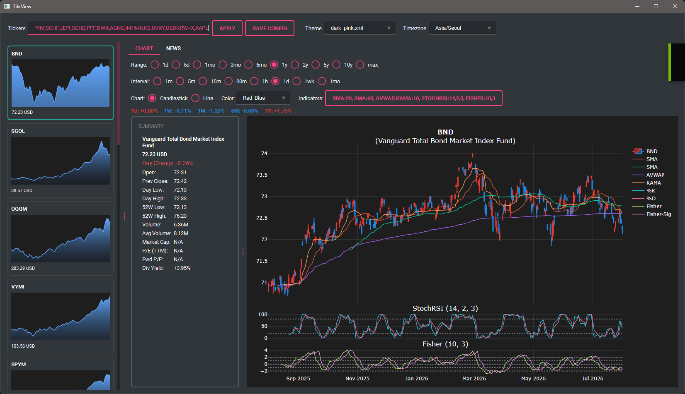
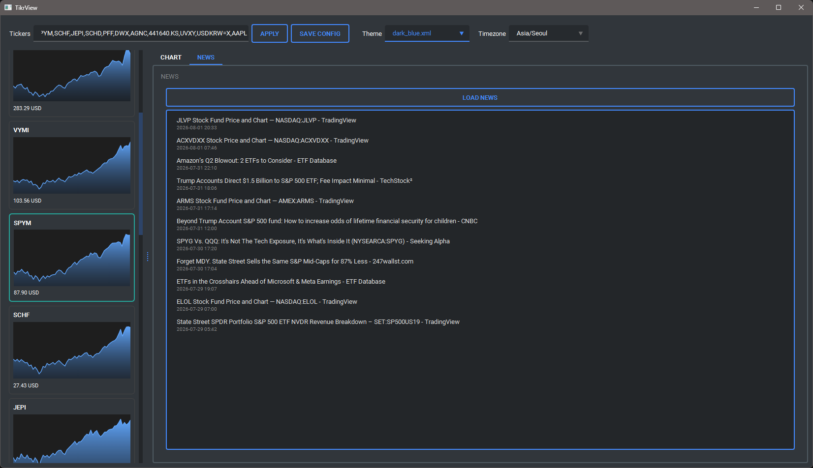

# TikrScope

A minimal, interactive stock market viewer.  

## Features

- Summary of stock and ETFs  
- Line and candlestick chart views  
- Support for multiple indicators (e.g., SMA, AVWAP, Williams %R, Stochastic RSI, KAMA, Fisher)  
- News search for stock and ETFs (Note. experimental)  
- Customizable configuration (time range, timezone, theme, etc.)  
- Chart thumbnail previews  

## Install

### Using the default Python

```bash
pip install uv
uv venv
uv sync
```

### Using a specific Python version

```bash
pip install uv
uv venv --python 3.12
uv sync
```

## Run

### CLI

```bash
python cli.py thumbnail AAPL MSFT NVDA AMZN GOOGL META --range 6mo --interval 1d --cols 2
python cli.py thumbnail AAPL MSFT --timezone America/New_York
python cli.py chart AAPL --range 1y --interval 1d --indicators SMA:20 SMA:60 AVWAP KAMA:10
python cli.py chart AAPL --type line --indicators MFI:14 WilliamsR:14 Fisher:10,3 StochRSI:14,2,3
python cli.py chart BTC-USD --range 3mo --interval 4h --indicators SMA:20 AVWAP MFI:14 Fisher:10,3
python cli.py chart AAPL --candle-color red_blue
python cli.py chart AAPL --timezone America/New_York --indicators SMA:20
"""
```

### Dashboard

```bash
uv run python dashboard.py
```

## Preview

  

